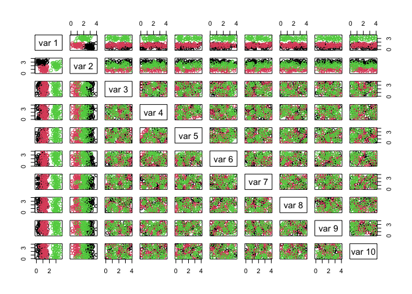
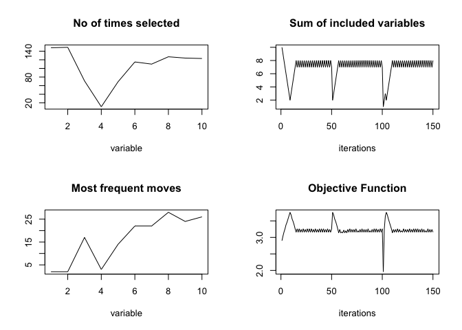
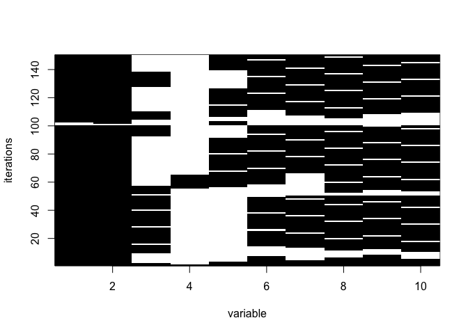

# tabuSearch

R based tabu search algorithm for binary configurations. Main function
is tabuSearch.

## Installation

You can install the development version of tabuSearch from
[GitHub](https://github.com/) with:

``` r
# install.packages("devtools")
devtools::install_github("domijan/tabuSearch")
```

## Example

An example for how it works. We’ll simulate 10-d data: 150 samples from
3 bivariate normals and 8 noise variables. Variable selection should
recover the first two variables.

``` r
library(tabuSearch)

 
library(MASS) # use function mvrnorm to simulate from a multivariate Normal distribution

NF <- 10 # number of features
G <- 3 # number of groups
NTR <- 50 # number of training samples per group
NTE <- 50 # number of test samples per group


# means and covariances for the 3 groups
muA <- c(1,3)
SigmaA <- matrix(c(0.2, 0.04, 0.04, 0.2), 2, 2)
muB <- c(1.2,1)
SigmaB <- matrix(c(0.1, -0.06, 0.004, 0.2), 2, 2)
muC <- c(3,2)
SigmaC <- matrix(c(0.2, 0.004, 0.004, 0.2), 2, 2)


set.seed(1234)
# Training set
train <- rbind(mvrnorm(NTR, muA, SigmaA), mvrnorm(NTR, muB, SigmaB), mvrnorm(NTR, muC, SigmaC))

# Test set
test <- rbind(mvrnorm(NTE, muA, SigmaA), mvrnorm(NTE, muB, SigmaB), mvrnorm(NTE, muC, SigmaC))


# Add noise variables
train <- cbind(train, matrix(runif(G * NTR * (NF - 2), 0, 4), nrow = G * NTR, ncol = (NF-2)))

test <- cbind(test, matrix(runif(G * NTE * (NF - 2), 0, 4), nrow = G * NTE, ncol = (NF-2)))

# Group labels (target variables)
wtr <-  as.factor(rep(1:G, each = NTR))
wte <-  as.factor(rep(1:G, each = NTE))


# Visualize the training data
pairs(train, col = wtr)
```



``` r


library(e1071) # for SVM implementation

# Objective function for tabu search
evaluate <- function(th){ 
    if (sum(th) == 0)return(0)             
    model <- svm(train[ ,th==1], wtr , gamma = 0.1)
    pred <- predict(model, test[ ,th==1])
    csRate <- sum(pred == wte)/NTE 
    penalty <- (NF - sum(th))/NF 
    return(csRate + penalty)
}  
 
# Run tabuSearch
res <- tabuSearch(size = NF, iters = 50, objFunc = evaluate, config = matrix(1,1,NF), listSize = 5, nRestarts = 4) 


plot(res)
```



``` r
plot(res, "tracePlot")
```



``` r

# Best configuration found
summary(res, verbose = TRUE)
#> Tabu Settings
#>   Type                                       = binary configuration
#>   No of algorithm repeats                    = 1
#>   No of iterations at each prelim search     = 50
#>   Total no of iterations                     = 150
#>   No of unique best configurations           = 39
#>   Tabu list size                             = 5
#>   Configuration length                       = 10
#>   No of neighbours visited at each iteration = 10
#> Results:
#>   Highest value of objective fn    = 3.76
#>   Occurs # of times                = 3
#>   Optimum number of variables      = c(2, 2, 2)
#> Optimum configuration: 
#>      [,1] [,2] [,3] [,4] [,5] [,6] [,7] [,8] [,9] [,10]
#> [1,]    1    1    0    0    0    0    0    0    0     0
#> [2,]    1    1    0    0    0    0    0    0    0     0
#> [3,]    1    1    0    0    0    0    0    0    0     0
```
